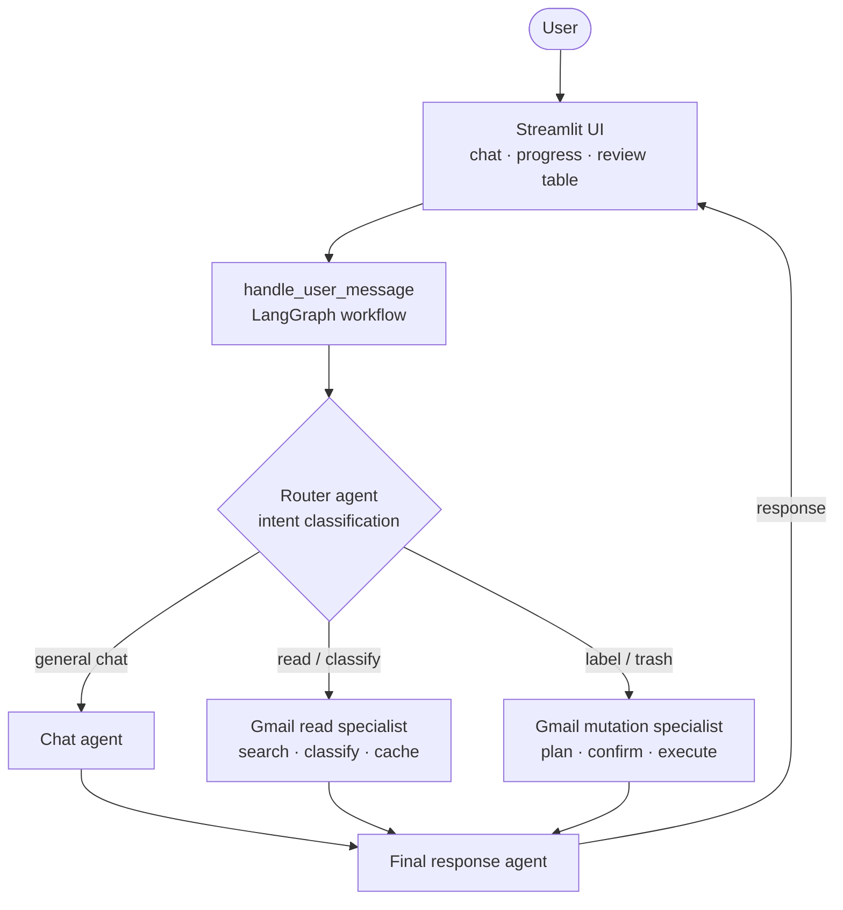
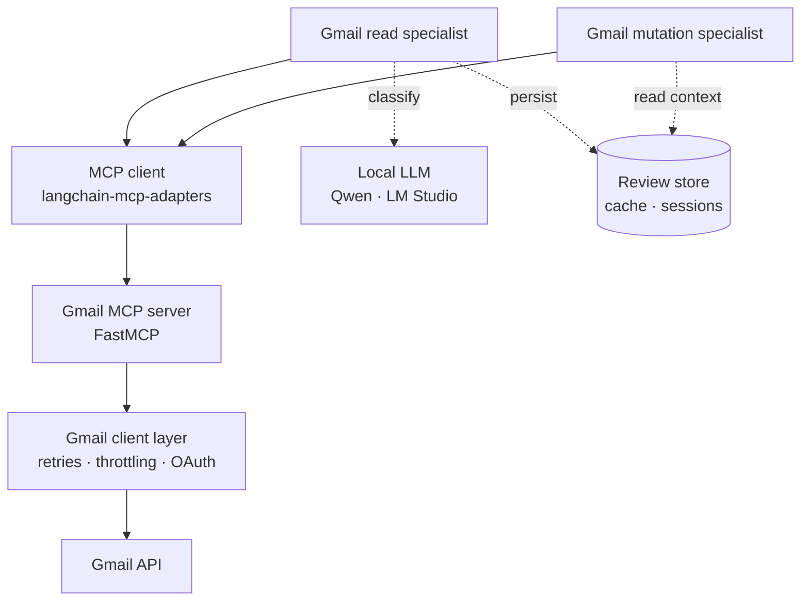
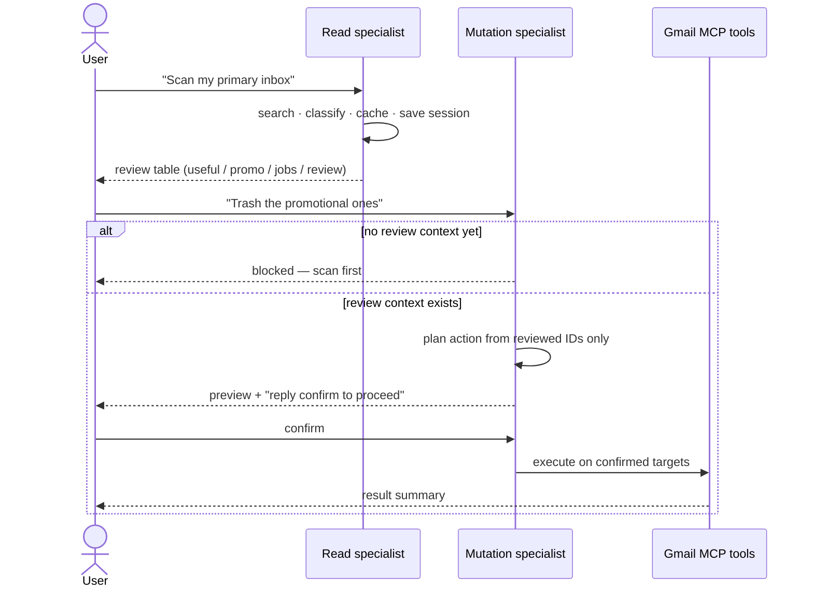

# Gmail Review Agent

**A privacy-first, multi-agent assistant that reviews, classifies, and safely cleans up Gmail — powered by a custom MCP server, LangGraph orchestration, and a fully local LLM.**

[](https://www.python.org/)
[](https://langchain-ai.github.io/langgraph/)
[](https://modelcontextprotocol.io/)
[-EF9F27.svg)](https://lmstudio.ai/)

This project is a working example of **production-minded agentic AI design**: specialist agents with explicit routing, a Model Context Protocol (MCP) tool server, human-in-the-loop controls on every destructive action, and a model that runs entirely on your own machine so no mailbox data ever leaves it.

---

## Why this project is interesting

Most "AI email" demos are a single prompt wired to a model. This one is built the way an enterprise agent system should be:

- **Real multi-agent orchestration** — a router classifies intent and dispatches to specialist agents, each with its own tools and system prompt, coordinated through a LangGraph state machine.
- **A custom MCP server** — Gmail is exposed as a clean set of typed MCP tools (`search_gmail`, `get_gmail_message`, `apply_gmail_label`, …), decoupling the model from the API.
- **Safety by architecture, not by hope** — the read agent *structurally cannot* mutate your mailbox; destructive actions are blocked until emails have been reviewed and require explicit confirmation before they run.
- **Local-first privacy** — classification runs on a local, OpenAI-compatible model (Qwen via LM Studio). Email content stays on your device.
- **Operational hygiene** — request throttling, exponential backoff with jitter, OAuth refresh, a persistent review cache, and path-traversal guards on session files.

### A generalisable enterprise integration pattern

Gmail already offers an official MCP server — so rather than use it, this project **deliberately implements a new MCP server directly on the Gmail APIs**. Building the server from scratch demonstrates a pattern that generalises well beyond email: any enterprise system with an API or SDK — PeopleSoft, SAP, a data warehouse, ServiceNow, and similar platforms — can be exposed as a custom MCP server, with a corresponding specialist agent added on the agent side to operate it.

Gmail is simply a concrete, accessible example of the general shape:

```
External system API/SDK  →  adapter layer  →  custom MCP server (typed tools)  →  specialist agent
```

The same three-part structure used here — an adapter (`gmail_client.py`) over the system's API, a typed MCP tool surface (`server.py`), and a dedicated specialist agent that knows how to use those tools — is exactly what you would apply to bring an enterprise system into an agentic architecture. Most of these platforms do not yet ship official MCP servers, so custom servers like this one are the practical way to make them available to agents today.

> Note: this project demonstrates the *integration pattern* using Gmail as a representative system. It does not include connectors for PeopleSoft, SAP, ServiceNow, or data-warehouse systems — those are named to illustrate where the same approach applies.

---

## Architecture

The system is layered so each concern is isolated: the **UI** never talks to Gmail directly, the **agents** never call the Gmail API directly, and the **MCP server** is the single, typed boundary between the model and the mailbox.

**Request flow** — how a user message moves through the agents:



**Integration layer** — how the Gmail specialists reach the mailbox and local resources:



---

## The safety model

Every mailbox-modifying action passes through a deliberate review-then-confirm gate. This is the design feature most agentic email tools skip — and the one that makes this safe to point at a real inbox.



Guarantees enforced in code:

- The **read specialist has no mutation tools** — it physically cannot label, archive, or trash.
- The **mutation specialist is blocked** until a review session exists, and only ever targets message IDs that appear in reviewed results.
- **Nothing destructive runs without an explicit confirmation** following a previewed pending action.
- **Trash, not delete** — messages are moved to Trash and remain recoverable.
- Review-session file paths are validated to stay inside the project's sessions directory (path-traversal guard).

### Server-side credential boundary

Gmail OAuth credentials and every Gmail API call live **entirely inside the MCP server layer** (`auth.py` + `gmail_client.py`, behind `server.py`). The agents and UI never hold tokens or touch the Gmail API directly — they communicate only through typed MCP tools. This boundary is what makes the architecture both safer and scalable:

- **Reduced attack surface** — Gmail credentials and raw API access are never exposed to the agent or client side. End-user exposure is limited to the agent interface, so the sensitive Gmail integration stays isolated on the server.
- **Enterprise-ready scaling** — with credentials centralised server-side, user identity can be handled separately at the application layer. That makes it straightforward to add per-user authentication and to enable or disable individual user access centrally — a prerequisite for running this pattern as a multi-user service in an enterprise environment.

> This separation is a deliberate architectural choice. Keeping the Gmail integration and credentials behind the MCP server boundary is what allows the application to scale to multiple users and to be deployed securely in an enterprise environment — by layering application-side authentication and centralised access control on top, without ever exposing Gmail credentials to the client.

---

## Key features

| Capability | What it does |
|---|---|
| Intent routing | A router agent classifies each message and dispatches to the right specialist. |
| Email classification | Categorises mail into `useful`, `promotional`, `job_notifications`, or `need_further_review` with a confidence and reason. |
| Cache-aware review | A persistent local cache avoids re-classifying messages already seen, with a "fresh scan" override. |
| Review sessions | Each scan is saved as a timestamped JSON session, viewable and downloadable in the UI. |
| Human-in-the-loop edits | Users can inspect, filter, and re-categorise results before any action is taken. |
| Safe mutations | Label and trash operations run only after review and explicit confirmation. |
| Resilient Gmail access | Throttling, retry with jittered backoff, and transient-error handling around the Gmail API. |
| Local-first privacy | Classification runs on a local OpenAI-compatible model; mailbox content never leaves the machine. |

---

## Tech stack

- **Orchestration:** LangGraph (`StateGraph`, ReAct agents), LangChain core
- **Protocol:** Model Context Protocol via FastMCP (server) and `langchain-mcp-adapters` (client)
- **Model runtime:** Local OpenAI-compatible endpoint (Qwen on LM Studio)
- **Email:** Gmail API with Google OAuth (`gmail.modify` scope)
- **UI:** Streamlit
- **Language:** Python 3.11+

---

## Project structure

```
gmail-mcp/
├── server.py            # FastMCP server — exposes Gmail operations as MCP tools
├── gmail_client.py      # Gmail API layer — search, read, label, trash, retries, throttling
├── auth.py              # Google OAuth credential loading and refresh
├── agent.py             # Routing, specialist agents, LangGraph workflow, review tools, CLI
├── streamlit_app.py     # Chat UI, progress display, review table
├── diagnostics.py       # Smoke checks for model, tools, and MCP connectivity
├── docs/md_files/       # Agent-context docs (CLAUDE.md, AGENTS.md)
├── PROJECT_RULES.md     # Always-on safety, privacy, and contribution rules
├── MAINTENANCE_RULES.md # Documentation-maintenance workflow
├── requirements.txt     # Pinned runtime dependencies
└── requirements.md      # Full setup and privacy checklist
```

---

## MCP tools

The MCP server exposes a deliberately small, typed surface, split by risk:

**Read-only**
`search_gmail` · `search_gmail_date_window` · `get_gmail_message` · `preview_delete`

**Mutation-capable** (confirmation-gated)
`apply_gmail_label` · `move_gmail_message_to_trash` · `trash_gmail_messages_by_label`

---

## Getting started

> Requires Python 3.11+, a Google Cloud OAuth client for the Gmail API, and a local OpenAI-compatible model server (e.g. LM Studio) running before launch.

```bash
# 1. Create and activate a virtual environment
python -m venv .venv
source .venv/bin/activate        # Windows: .venv\Scripts\activate

# 2. Install dependencies
python -m pip install -r requirements.txt

# 3. Add your Google OAuth client config to the project root
#    (see requirements.md for the exact setup steps)

# 4. Start your local model server (LM Studio, OpenAI-compatible endpoint)

# 5. Launch the app
streamlit run streamlit_app.py
```

A first run will open a local browser flow to authorise Gmail access. See [`requirements.md`](requirements.md) for the complete setup, scopes, and privacy checklist.

### Privacy & credentials

OAuth secrets, tokens, the review cache, and saved sessions are local-only and are excluded from version control. No mailbox-derived data is ever committed. See [`PROJECT_RULES.md`](PROJECT_RULES.md) for the full privacy model.

---

## Roadmap

- [ ] Evaluation harness — labelled fixtures with precision/recall on classification
- [ ] Upgrade experimentation with Qwen 3.5 27B for more precise tool calling
- [ ] Additional specialist agents and MCP servers (Calendar, Tasks)
- [ ] Introduction of WebMCP

---

## About

Built as a hands-on exploration of agentic AI architecture — MCP tool design, multi-agent orchestration, and enterprise-grade safety and privacy controls — by a product leader working at the intersection of enterprise transformation and applied AI.

**GitHub:** [github.com/Shariq-Beg](https://github.com/Shariq-Beg)
